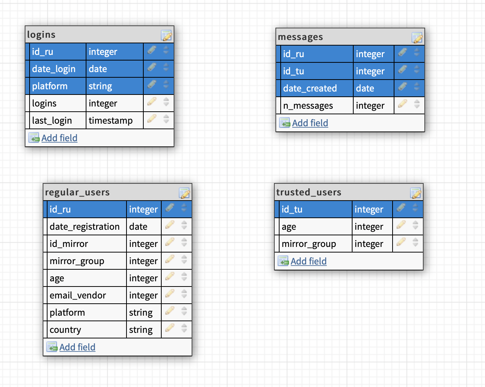
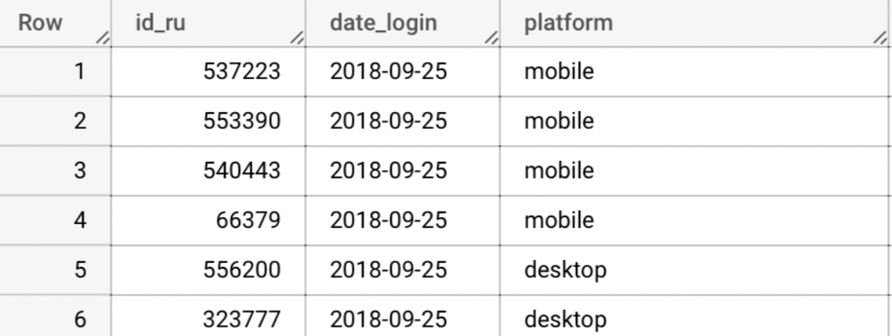
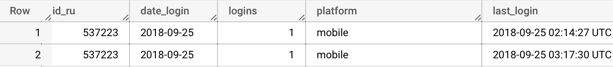

# Data Engineering Testcase   Time spent: 6 hours

## Data Description

The product is a marketplace where there are **regular_users** (ru) attracted through marketing channels and **trusted_users** (tu) who are partners of the product.



- **regular_users** and **trusted_users** can communicate with each other
- **logins** - aggregated table of user “login” activities. UK: id_ru, date_login, platform
- **messages** - aggregated table of sent messages. UK: id_ru, id_tu, date_created

## Tasks

### **Analyst Pasha, who uses table logins to build a report, finds duplicate rows in that table.**

Duplicate UK examples:

| id_ru | date_login | platform |
| --- | --- | --- |
| 74061 | 2018-09-11 | mobile |
| 3187499 | 2018-12-14 | desktop |
| 1120354 | 2018-10-11 | desktop |
- **Make sure that the duplicates exist**
    
    The simplest way to do it - write a query that GROUP results on the unique set of columns and COUNT number of rows in each group. For example:
    
    ```sql
    SELECT id_ru, date_login, platform 
    FROM `project_data.logins` 
    GROUP BY id_ru, date_login, platform 
    HAVING COUNT(*) > 1;
    /* we also can use COUNT(id_ru) for optimization purpose */
    ```
    
    
    
    Another option is just to try to add UNIQUE CONSTRAINT on that columns. The database should allow it only if there are no duplicates for the specified set of columns in the table. But is not applicable to BigQuery, so let’s concentrate on the first option.
    
    As the result of the first query, we have the list of duplicated column sets.  Try to check one of them to determine the reason for this behaviour.
    
    ```sql
    SELECT id_ru, date_login, logins, platform, last_login 
    FROM `project_data.logins` 
    WHERE id_ru=537223 
    AND date_login='2018-09-25' 
    AND platform='mobile';
    ```
    
    
    
    Here we can clearly see the possible problem of the duplicates. For some cases, *logins* counter doesn’t increase but creates a duplicate record for the new login. 
    
- **Get rid of duplicates** **(one record should be left!)**
    
    Previously, we conducted a short analysis of the problem and found out that the issue is in the creation of duplicated login attempts instead of increasing the login counter.
    
    To keep the data consistent, we should remove these duplicates, increase *logins* counter and update *last_login* field. The best available option is to use the MERGE statement. 
    
    ```sql
    MERGE `project_data.logins` target
    USING (
      SELECT id_ru, date_login, platform, SUM(logins) AS logins, MAX(last_login) AS last_login
    	FROM `project_data.logins` 
    	GROUP BY id_ru, date_login, platform 
    ) source
    ON target.id_ru = source.id_ru 
    AND target.date_login = source.date_login 
    AND target.platform = source.platform 
    AND target.last_login = source.last_login
    WHEN MATCHED THEN UPDATE SET logins = source.logins
    WHEN NOT MATCHED THEN DELETE;
    ```
    
    Another option is to use several statements or just recreate the table, but they all have a higher cost.
    

### **Analyst Pasha, who needs to compile a report on sending messages in the first 2 days of a user's life, turned to you for help in creating a new aggregated table.**

Table description:

| Description | Column name | Type | From |
| --- | --- | --- | --- |
| user’s registration date (regular users) | date_registration | date | regular_users |
| country of regular users | country | string | regular_users |
| age bins (55+, 45-55, 35-45, 25-35, 25+) | age_bin | integer | regular_users |
| mirror_group | mirror_group | integer | regular_users |
| registration platform for regular users | platform | string | regular_users |
| number of messages | n_messages | integer | messages |
| date difference between message date_created and user  date_registration | message_lifetime | date | messages, regular_users |

Tasks:

- Write SQL query to create such table
    
    ```sql
    CREATE OR REPLACE TABLE `project_data.message_history`
    AS
    SELECT RU.date_registration, RU.country, RU.mirror_group, RU.platform,
    /* Better to store age bins into int numbers */
    CASE
      WHEN RU.age > 55 THEN '55+'
      WHEN RU.age > 45 THEN '45-55'
    	WHEN RU.age > 35 THEN '35-45'
    	WHEN RU.age > 25 THEN '25-35'
      ELSE '25-'
      END
    	AS age_bin,
    COALESCE(SUM(M.n_messages), 0) AS n_messages, 
    COALESCE(DATE_DIFF(M.date_created, RU.date_registration, DAY), 0) AS message_lifetime
    FROM `project_data.regular_users` RU 
    LEFT JOIN `project_data.messages` M
    ON RU.id_ru = M.id_ru
    WHERE DATE_DIFF(CURRENT_DATE(), RU.date_registration, DAY) > 1 
    AND DATE_DIFF(M.date_created, RU.date_registration, DAY) < 2
    GROUP BY M.id_tu, M.id_ru, M.date_created,
    RU.date_registration, RU.country, RU.age, RU.mirror_group, RU.platform;
    ```
    
    We need to join two tables. Having the assumption, that there can be a situation when the user didn’t write any message, we need to perform *LEFT JOIN* and conduct additional checks for null. After that, we need to select only regular users, that have been registered for two days and messages in a similar range, group them with the unique and required table columns and return the result.
    

### **After you decided to do the previous task with Pasha, it became clear that this tissue is necessary for detection on a daily basis. Describe the plan, and how would you do it (tools, code examples if needed)**

Such tasks are performed with the cron jobs. The support for this feature is implemented in lots of different tools, including Airflow and BigQuery. For Airflow, we simply define *schedule_interval* for the updating query (that is wrapped in the DAG), for BigQuery, we can use “BigQuery scheduled query”. The difference is that BigQuery queries allow only truncating or appending. Airflow DAGs give the ability not only to execute a simple query but to define a full pipeline, that can extract, transform and load data to the database.

The second option is more relevant for this test case. To implement it, we need to specify config, for example in python. 

```python
transfer_config = bigquery_datatransfer.TransferConfig(destination_dataset_id=dataset_id,
    display_name="Message history",
    data_source_id="scheduled_query",
    params={
        "query": query_string,
        "write_disposition": "WRITE_APPEND",
        "partitioning_field": "",
    },
    schedule="every 24 hours",
)

transfer_config = transfer_client.create_transfer_config(
    bigquery_datatransfer.CreateTransferConfigRequest(
        parent=parent,
        transfer_config=transfer_config,
        service_account_name=service_account_name,
    )
)
```

And the modified query.

```sql
SELECT RU.date_registration, RU.country, RU.mirror_group, RU.platform,
CASE
  WHEN RU.age > 55 THEN '55+'
  WHEN RU.age > 45 THEN '45-55'
	WHEN RU.age > 35 THEN '35-45'
	WHEN RU.age > 25 THEN '25-35'
  ELSE '25-'
  END
	AS age_bin,
COALESCE(SUM(M.n_messages), 0) AS n_messages, 
COALESCE(DATE_DIFF(M.date_created, RU.date_registration, DAY), 0) AS message_lifetime
FROM `project_data.regular_users` RU 
LEFT JOIN `project_data.messages` M
ON RU.id_ru = M.id_ru
WHERE DATE_DIFF(@run_date, RU.date_registration, DAY) = 2 
AND DATE_DIFF(M.date_created, RU.date_registration, DAY) < 2
GROUP BY M.id_tu, M.id_ru, M.date_created,
RU.date_registration, RU.country, RU.age, RU.mirror_group, RU.platform;
```

## Feedback

```sql
MERGE project_data.logins target 
USING ( 
  SELECT id_ru, date_login, platform, SUM(logins) AS logins, MAX(last_login) AS last_login
  FROM project_data.logins  
  GROUP BY id_ru, date_login, platform  
  -- Guess we should update only duplicated keys
  having count(*) > 1
) source 
ON target.id_ru = source.id_ru  
AND target.date_login = source.date_login  
AND target.platform = source.platform  
-- Now we should update only rows with same last_login
WHEN MATCHED AND target.last_login = source.last_login  THEN UPDATE SET target.logins = source.logins
-- And delete otherwise matched
WHEN MATCHED THEN DELETE;
```

> In general, this is a good solution. But there is a nuance that we assume that duplicates cannot have the same "last_login".
> 
> 
> So need to check this before implementing (spoiler alert: there are several duplicates with the equivalent of "last_login")
> 

```sql
SELECT RU.date_registration, RU.country, RU.mirror_group, RU.platform, 
CASE 
  WHEN RU.age > 55 THEN '55+' 
  WHEN RU.age > 45 THEN '45-55' 
  WHEN RU.age > 35 THEN '35-45' 
  WHEN RU.age > 25 THEN '25-35' 
  ELSE '25-' 
  END 
  AS age_bin, 
  -- Handled nulls here
COALESCE(SUM(M.n_messages), 0) AS n_messages,  
COALESCE(DATE_DIFF(M.date_created, RU.date_registration, DAY), 0) AS message_lifetime 
FROM project_data.regular_users RU  
LEFT JOIN project_data.messages M 
ON RU.id_ru = M.id_ru 
WHERE DATE_DIFF(@run_date, RU.date_registration, DAY) = 2  
-- But didn't do it in where clause. That turns left join into inner join
AND DATE_DIFF(M.date_created, RU.date_registration, DAY) < 2 
GROUP BY M.id_tu, M.id_ru, M.date_created, 
RU.date_registration, RU.country, RU.age, RU.mirror_group, RU.platform;
```

> There is also a minor note about this filter:
> 
> 
> ```sql
> DATE_DIFF(@run_date, RU.date_registration, DAY) = 2
> ```
> 
> We guess that it allows you to add a dataset without editing. But usually, analytics needs the most recent date and it makes sense to add zero (0 day) lifetime to the dataset. Thus, every day the update adds today-2day's 1 lifetime and today-1day's 0 lifetime.
>
